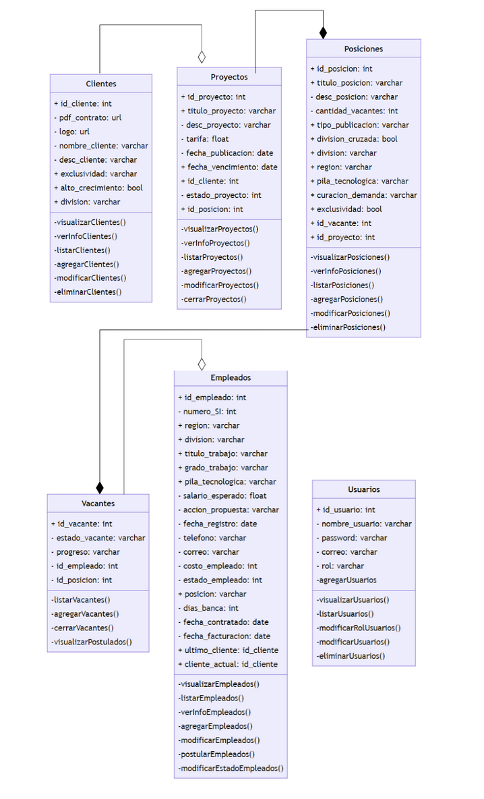

# Actividad 3.7.4
## Seminario Evaluativo: Programación en el lado del servidor
#### Construcción de Software y Toma de Decisiones 

### Integrantes 

- Daniel Fernández Clausen - A01254659
- Bruno Gaxiola González - A01253874
- Ramón Alberto Gómez Urquídez - A01254784
- Fernanda Granados Monge - A01252895
- Daniel Antonio Luján - A01254903
- Andrés Daniel Martínez Bermúdez - A00227463
- Santiago Eduardo Poblete Talamante - A01254609
- Francisco Rochín Gómez - A01252974
- Andrés Sandoval Ibarra - A01253138
- Martín Gerardo Tánori Sitten - A01252900

### Descripción

Se dividirán en los equipos de reto para realizar cada uno el seminario.
Por cada equipo se dividirán en parejas para implementar un CRUD correspondiente a una entidad de la base de datos del reto.
Se debe entregar una única aplicación en un repositorio de git.

- Cada pareja trabajará su funcionalidad desde un branch del mismo proyecto
- Se deberá hacer el merge de las ramas hacia la rama principal
- Se deberá probar cada endpoint de la API de la entidad seleccionada desde Postman

En esta tarea debe subirse la dirección del repositorio correspondiente.

### Ejercicio 
Utilizando la estructura de una entidad del reto, implemente una API RESTFull con los endpoints:
- Obtener todos los elementos de una tabla mediante GET `http://localhost:3000/`
- Crear un nuevo elemento de una tabla mediante POST `http://localhost:3000/`
- Modificar un elemento de una tabla mediante PATCH `http://localhost:3000/[id]`
- Eliminar un elemento de una tabla mediante DELETE `http://localhost:3000/`
- Obtener un elemento de una tabla dado su id GET `http://localhost:3000/[id]`

## Diagramas Entidad - Relación 

## Requisitos técnicos

1. No es necesario implementar programación client-side.
2. El código debe ser implementado utilizando Typescript y NodeJS

